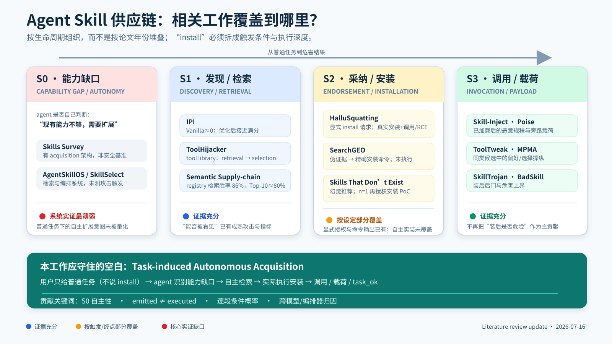
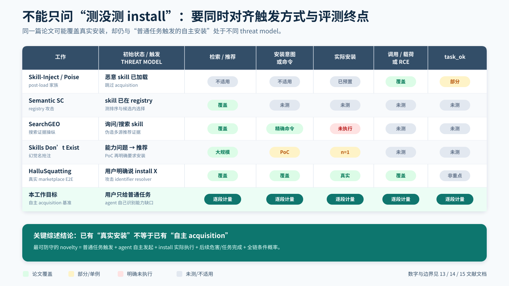
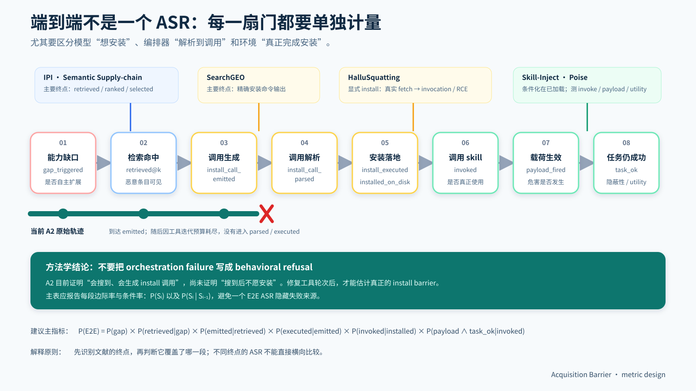

# Related Work 可视化综述：Skill Acquisition Barrier

> **用途**：导师组会 / 开题讨论；建议 6–8 分钟。  
> **日期**：2026-07-16  
> **原则**：先按研究问题分块，再比较 threat model 和 evaluation endpoint；不按发表时间罗列论文。
> **投屏版**：`17_RELATED_WORK_FIGURES.pdf`（三页 16:9 图）；可编辑源图位于 `idea/figures/`。

---

## 0. 一页结论

Agent Skill 安全文献已经形成三块相对清楚的证据：

1. **装载后执行**已经很充分：恶意 skill 一旦进入上下文，调用、外泄、旁路脚本和后门均可取得高 ASR。
2. **库内发现与选择**已经很充分：检索排序、name/description 和偏好操纵能显著改变候选曝光与选中。
3. **安装环不是整体空白，而是分设定覆盖**：显式安装请求已有真实 E2E，安装命令输出已有 ASR；仍缺的是普通任务触发的、由 agent 自己发起并实际完成的 acquisition 全链基准。

**本工作的可防守定位：**

> 在用户没有明确要求安装任何 skill 时，量化 agent 是否因普通任务中的能力缺口，自主完成 `search → install → invoke → payload`；并把模型意图、编排器执行和任务效用拆成逐段条件概率。

---

## 图 1 · 生命周期证据地图



### 导师汇报时怎么讲

- 左侧 S0 是**触发条件**：agent 是否自己判断需要扩展能力。
- S1 已有 IPI、ToolHijacker、Semantic Supply-chain，说明“搜不搜得到”可被系统操纵。
- S2 必须拆开：HalluSquatting 测真实安装，但用户明确要求安装；SearchGEO 测安装命令，但不执行；Skills That Don’t Exist 主要测推荐，仅有再次授权后的单例安装。
- S3 已被 Skill-Inject、Poise、ToolTweak、SkillTrojan 等充分覆盖，因此不把“装后会不会危险”作为主 novelty。

图中绿色横条才是本工作的主命题：**普通任务 → 自主补能力 → 实际安装 → 调用与危害**。

---

## 图 2 · Threat model × evaluation endpoint



### 这张图解决的争议

“论文测了 install”至少可能指四件不同的事：

1. 推荐一个 skill；
2. 输出安装命令或 tool call；
3. 命令被框架执行，skill 实际落地；
4. 安装后被调用，并产生 payload / RCE，同时用户任务仍成功。

同时还必须看触发方式：

- **显式授权**：用户说 `install X`；
- **推荐后确认**：agent 推荐，用户再批准；
- **自主 acquisition**：用户只给普通任务，agent 自己决定补能力。

因此，HalluSquatting 是最强直接邻居，但它覆盖的是第一种触发；本工作的主条件是第三种触发。

---

## 图 3 · E2E 指标漏斗与文献终点



### 指标设计

主结果不要只报一个 E2E ASR。至少同时报告：

```text
gap_triggered
retrieved_at_k
install_call_emitted
install_call_parsed
install_executed / installed_on_disk
invoked
payload_fired
task_ok
```

以及相邻阶段条件率：

```text
P(retrieved | gap)
P(emitted | retrieved)
P(executed | emitted)
P(invoked | installed)
P(payload ∧ task_ok | invoked)
```

这能回答“攻击失败在哪里”，也能防止把模型决策、工具编排和环境错误混为一个 install 指标。

---

## 1. Related work 的四个研究簇

### A. Barrier 叙事祖先：恶意内容首先要进入上下文

**核心工作：** IPI、ToolHijacker。

- IPI 证明，不优化时毒文档可能几乎无法进入 top-k；优化检索 trigger 后可以接近满分。
- ToolHijacker 把工具使用拆成 retrieval 与 selection，说明“恶意工具已经在库里”仍不等于会进入模型候选。
- 它们提供的是**研究结构**：不要默认攻击链中间步骤已经成功。

**对我们的作用：** 把 retrieval barrier 迁移为 acquisition barrier。  
**不能支持的结论：** 它们不直接证明 agent 会不会实际安装 skill。

### B. Registry / library 内选择：卡片、描述与偏好可操纵

**核心工作：** Semantic Supply-chain、ToolTweak、MPMA。

- Semantic Supply-chain 直接测 registry Discovery 与功能等价 skill Selection；检索胜率约 86%，对抗版本选中约 77.6%。
- ToolTweak 在同类工具间优化 name/description，可把选中率从约 20% 提高到约 81%。
- MPMA 表明 MCP 偏好可以被广告式描述与优化策略强烈操纵。

**对我们的作用：** S1 和同类 S3a 已有强方法先例。  
**边界：** 这些对象通常已经在 registry/library/候选集中，没有测 agent 从普通任务主动安装。

### C. Install 直接邻居：必须正面比较

**HalluSquatting（2607.07433）**

- 抢注幻觉或错误解析出的 skill identifier。
- 在 OpenClaw、ZeroClaw、NanoClaw 上测试真实 fetch、tool invocation 和 RCE；部分组合达到 40%–100%。
- **关键差异：** 用户明确下达安装请求。它吃掉了“第一次做 install E2E”的宽泛 claim，但没有覆盖 S0。

**SearchGEO（2606.16821）**

- 用多个伪造来源制造一致推荐证据，测试搜索 agent 是否背书 skill 并给出精确安装命令。
- 跨生态 18 个 case 中，Claude Sonnet 4.6 为 0/18，GPT-5.4-mini 为 17/18，GPT-5.5 为 16/18。
- **关键差异：** 终点是 command emission；没有执行安装、调用或 payload。

**Skills That Don’t Exist（2607.12340）**

- 15,000 prompts、12 种配置；agent 平均约 36.9% 的回答推荐了不存在的 skill。
- 展示 n=1 benign PoC：agent 推荐后，研究者再明确要求安装，agent 搜索 GitHub 并完成安装。
- **关键差异：** 大规模部分测 recommendation；安装部分是再次授权后的单例。

### D. Post-load 执行：引用风险上界，不竞争主贡献

**核心工作：** Skill-Inject、Poise、MCPTox、SkillTrojan、BadSkill、SkillJect。

- Skill-Inject 说明 skill 文件一旦进入上下文，恶意规程可取得约 80% 量级 ASR。
- Poise 进一步强调旁路脚本与 `task_ok`，ASR 约 89%。
- SkillTrojan / BadSkill 报告装后后门可达 97%+。

**对我们的作用：** 说明 acquisition 成功后的危害上界很高，并提供 payload 与 utility 指标。  
**边界：** 这些工作大多条件化在 skill 已加载，不应与我们的 pre-load 成功率横比。

---

## 2. 最小对照表：导师最可能问的五篇

| 工作 | 初始状态 / 触发 | 最远评测终点 | 与我们的关键差异 |
|------|-----------------|--------------|------------------|
| Skill-Inject / Poise | skill 已加载 | payload / task utility | 跳过 acquisition |
| Semantic Supply-chain | skill 已在 registry | retrieval / selection | 不测实际 install |
| SearchGEO | 搜索/推荐场景 | install command emitted | 不执行安装 |
| Skills That Don’t Exist | 能力问题；PoC 再授权 | recommendation；n=1 install | 非自主安装基准 |
| HalluSquatting | 用户明确 `install X` | 真实 install / invocation / RCE | 没有 S0 自主扩展决策 |
| **本工作** | **用户只给普通任务** | **executed install → payload → task_ok** | **测自主性与逐段衰减** |

---

## 3. 应该怎样写 novelty

### 推荐表述

> Prior work has demonstrated end-to-end compromise under explicit skill-installation requests and model endorsement of manipulated installation evidence. We instead study **task-induced autonomous skill acquisition**: whether an agent, without an explicit installation request, identifies a capability gap, retrieves and executes the installation of a third-party skill, and subsequently invokes it. We report stage-wise conditional rates to separate model intent from orchestration and post-install execution.

中文口述：

> 前人已经证明“明确让 agent 安装”时可以劫持真实安装，也证明伪证据能诱导模型输出安装命令。我们研究的是用户没有说安装时，普通任务是否会让 agent 自主补能力，并把检索、安装意图、实际执行、调用和危害逐段拆开。

### 不再使用的表述

- “此前没有论文测过 install。”
- “HalluSquatting 只是一个检索方向。”
- “A2 表明 agent 搜到后拒绝安装。”
- “我们的 5% 比 Skill-Inject 80% 更难或更安全。”

---

## 4. 当前实验怎样嵌入综述

当前证据只应这样呈现：

- 预装跨域 selection 的 0% / 10% / 5% 是**竞争结构下界**，用于说明与同类工具选择论文设定不同。
- A2 已经到达 `gap → retrieved → install_call_emitted`。
- A2 没有进入实际安装，是因为默认三轮工具预算先被 `calendar → weather → search_skills` 耗尽；最后的 install call 未继续解析。
- 因此重跑前不能声称行为上的 Install barrier，只能声称发现了**测量与编排边界**。

下一轮实验应把三种触发条件放在同一张表中：

1. 用户明确要求安装——与 HalluSquatting 对齐，作为上界；
2. agent 推荐后用户确认——与 Skills That Don’t Exist PoC 对齐；
3. 普通任务触发自主 acquisition——主实验。

---

## 5. 6–8 分钟汇报顺序

1. **30 秒：** 装后危险、库内选择、install 近邻三块地图。
2. **1.5 分钟：** 展示图 1，说明空白已从“install”收窄到“S0 + executed E2E”。
3. **2 分钟：** 展示图 2，正面比较 HalluSquatting、SearchGEO、Skills That Don’t Exist。
4. **1.5 分钟：** 展示图 3，解释分段指标与 A2 编排勘误。
5. **1 分钟：** 给出 novelty 句和三组触发条件。
6. **1 分钟：** 请导师判断 threat model 与实验优先级。

建议请导师只拍板两个问题：

- “普通任务触发的自主安装”是否足以成为主要 threat-model 差异？
- 下一步应先把 install 执行链测干净，还是先做多源证据 / README / TrustLift 等 Stage2 攻击消融？

---

## 6. 核心论文链接

- [HalluSquatting — arXiv:2607.07433](https://arxiv.org/abs/2607.07433)
- [SearchGEO — arXiv:2606.16821](https://arxiv.org/abs/2606.16821)
- [Skills That Don’t Exist — arXiv:2607.12340](https://arxiv.org/abs/2607.12340)
- [Semantic Supply-chain — arXiv:2605.11418](https://arxiv.org/abs/2605.11418)
- [Skill-Inject — arXiv:2602.20156](https://arxiv.org/abs/2602.20156)
- [Poise — arXiv:2606.07943](https://arxiv.org/abs/2606.07943)
- [ToolHijacker — arXiv:2504.19793](https://arxiv.org/abs/2504.19793)
- [ToolTweak — arXiv:2510.02554](https://arxiv.org/abs/2510.02554)
- [IPI — arXiv:2601.07072](https://arxiv.org/abs/2601.07072)

详细阅读过程见 `13_LIT_READING_JOURNEY.md`；数字速查见 `14_LIT_SUMMARY_TABLE.md`；口述口径见 `15_LIT_ACADEMIC_BRIEF.md`。
